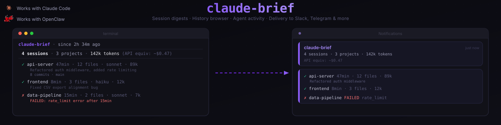
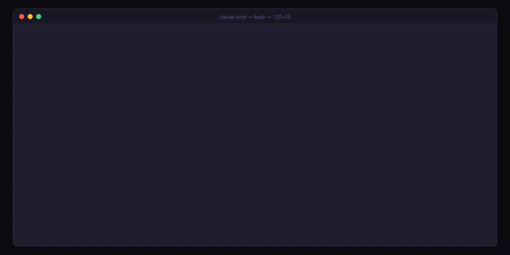

<p align="center">
  
</p>

# claude-brief

**Pick up exactly where your agents left off.**

[](https://www.npmjs.com/package/claude-brief)
[](LICENSE)
[](https://nodejs.org)
[](https://claude.ai/code)
[](https://openclaw.ai)

<p align="center">
  
</p>

claude-brief hooks into Claude Code's session lifecycle and gives you an instant,
structured digest of everything your agents accomplished -- files changed, commits made,
costs incurred, errors hit -- since the last time you checked. Run it after a meeting,
after lunch, or after a weekend. Works with Claude Code Routines, OpenClaw gateways,
Telegram, Slack, Discord, and ntfy.

## Install

```bash
npm install -g claude-brief
claude-brief install
```

Or without installing:
```bash
npx claude-brief install
```

**OpenClaw gateway:**
```bash
curl -fsSL https://raw.githubusercontent.com/jakeefr/claude-brief/main/openclaw/install.sh | bash
```

## Usage

```
claude-brief              # Digest since last run
claude-brief --since 2h   # Last 2 hours
claude-brief --since 24h  # Last 24 hours
claude-brief --since 7d   # Last 7 days
claude-brief tui          # Interactive history browser
claude-brief dashboard    # Web viewer (opens in browser)
claude-brief status       # One-line status
```

### Example output

```
claude-brief  .  since 2h 34m ago
==========================================================

  4 sessions  .  3 projects  .  142k tokens  (API equiv: ~$0.47)

----------------------------------------------------------

  v  api-server       47 min  .  12 files  .  sonnet  .  89k  (~$0.21)
     Refactored auth middleware, added rate limiting
     8 commits  .  main

  v  frontend         8 min   .  3 files   .  haiku   .  12k  (~$0.03)
     Fixed CSV export alignment bug

  v  frontend         23 min  .  5 files   .  sonnet  .  34k  (~$0.18)
     Added pagination to /api/users endpoint
     3 commits  .  feat/pagination

  x  data-pipeline    15 min  .  2 files   .  sonnet  .  7k   (~$0.05)
     FAILED: rate_limit error after 15 min
     Last action: running pytest

----------------------------------------------------------

  !  Pending attention:
     . data-pipeline: test suite still failing

----------------------------------------------------------

  Run 'claude-brief tui' to explore history  .  'claude-brief dashboard' for web view
```

## What it tracks

| Data | Description |
|------|-------------|
| Sessions | Start time, duration, project, git branch |
| Files | Edited and created, with paths |
| Commits | Parsed from git commands |
| Tokens | Input, output, cache read, cache creation |
| Cost | Estimated USD per session and total |
| Model | Which Claude model was used |
| Tools | Breakdown of every tool called |
| Errors | Failed tool calls and session failures |
| Thinking | Whether extended reasoning was used |
| MCP | Third-party MCP tool usage counts |
| Subagents | Spawned subagent count |
| Web | Search and fetch request counts |

## Cost display

claude-brief detects your billing mode from `~/.claude/.credentials.json`:

- **Subscription users** (Pro/Max/Team): Token counts are shown prominently.
  API-equivalent cost is shown in parentheses for reference. You are not
  billed per-token on your subscription.

- **API users**: Estimated dollar cost is shown prominently, calculated from
  Anthropic's published per-token rates.

- **Overage billing**: Extra usage beyond subscription limits is billed at
  API rates. Run `claude-brief --api-rates` to see what overage sessions
  would cost.

### Detected plan tiers

claude-brief reads `rateLimitTier` from your credentials and maps it to a display name:

| rateLimitTier | Display |
|---|---|
| `default_claude_max_5x` | Max 5x ($100/mo) |
| `default_claude_max_20x` | Max 20x ($200/mo) |
| `default` | Pro ($20/mo) |
| `team` | Team |
| `enterprise` | Enterprise |

The tier appears in `claude-brief status` output so you always know which plan is active.

```bash
claude-brief                  # auto-detect billing mode
claude-brief --api-rates      # force API rate display
claude-brief config set billing-mode api          # always show dollar cost
claude-brief config set billing-mode subscription # always show tokens
claude-brief config set billing-mode auto         # detect from credentials
```

## CLI Commands

```
claude-brief                      # Show digest since last run (default)
claude-brief --since 2h           # Digest for last 2 hours
claude-brief --since 24h          # Digest for last 24 hours
claude-brief --since 7d           # Digest for last 7 days
claude-brief --project myapp      # Filter to specific project
claude-brief tui                  # Open interactive TUI history browser
claude-brief dashboard            # Open web viewer in browser (localhost:7878)
claude-brief watch                # Start background watcher (processes hook triggers)
claude-brief install              # Install hooks into .claude/settings.json
claude-brief uninstall            # Remove hooks
claude-brief status               # One-line status: sessions today, cost today, last run
claude-brief export --format json # Export session history as JSON
claude-brief export --format csv  # Export session history as CSV
```

## Delivery

### Slack

```bash
claude-brief config set slack-webhook https://hooks.slack.com/...
claude-brief config set schedule "0 */4 * * *"  # every 4 hours
```

### Telegram

```bash
claude-brief config set telegram-token YOUR_BOT_TOKEN
claude-brief config set telegram-chat-id YOUR_CHAT_ID
```

### ntfy

```bash
claude-brief config set ntfy-topic your-topic
```

### Discord

```bash
claude-brief config set discord-webhook https://discord.com/api/webhooks/...
```

### OpenClaw (WhatsApp, Discord, Signal, iMessage)

See the OpenClaw Gateway section below.

## Web Viewer

```bash
claude-brief dashboard
```

Opens a local web dashboard at `localhost:7878` with:
- Session timeline with click-to-expand detail modals
- Stats cards (sessions, cost, tokens, active projects)
- 7-day cost chart
- Project sidebar with session counts and costs
- Auto-refreshes every 30 seconds

## OpenClaw Gateway

For delivery via WhatsApp, Telegram, Discord, Signal, iMessage, or Line through OpenClaw:

```bash
curl -fsSL https://raw.githubusercontent.com/jakeefr/claude-brief/main/openclaw/install.sh | bash
```

Add to `~/.openclaw/config.yaml`:

```yaml
plugins:
  claude-brief:
    deliveryChannel: telegram
    deliveryTo: "YOUR_CHAT_ID"
    schedule: "0 8 * * 1-5"       # 8am weekdays
    lookbackHours: 0               # 0 = since last brief
```

Then send `/brief` to your bot for an on-demand digest.

## How it works

```
Claude Code session ends
  -> SessionEnd hook fires -> transcript_path provided
  -> claude-brief parses JSONL -> extracts tokens, files, tools, commits
  -> Stores summary in ~/.claude-brief/db.sqlite
  -> On demand: aggregates summaries -> formats digest
  -> Delivers via: terminal / Slack / Telegram / ntfy / OpenClaw
```

The database starts empty and populates automatically as Claude Code sessions complete. Run `claude-brief db reset` to clear all stored sessions if needed.

## Routine awareness (beta)

Routines run on Anthropic's cloud and don't produce local JSONL files. To include Routine activity in your briefs, add a `brief-log` step at the end of your Routine that writes a `.claude/brief-log.json` summary file to the repo. claude-brief will check for these files in workspace directories and include them in digests.

See `routines/brief-log.yaml` for a template.

## Multi-machine note

claude-brief reads local session data. For multi-machine setups, run claude-brief on each machine independently.

## Contributing

Pull requests welcome. Please open an issue first for major changes.

```bash
git clone https://github.com/jakeefr/claude-brief.git
cd claude-brief
npm install
npm run build
npm run dev    # watch mode
```

To test with sample data, seed the database with demo sessions:

```bash
npx tsx scripts/seed-demo.ts
claude-brief --since 24h
```

This populates `~/.claude-brief/db.sqlite` with four sample sessions matching the example output above. Run `claude-brief db reset` to clear them.

## License

MIT
